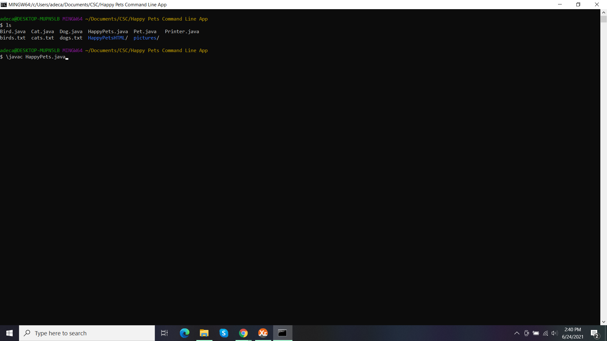
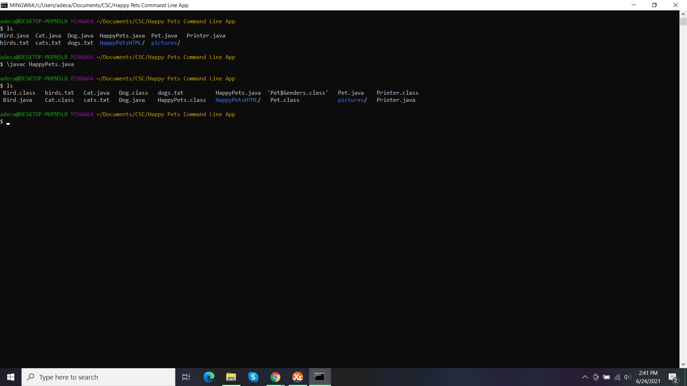
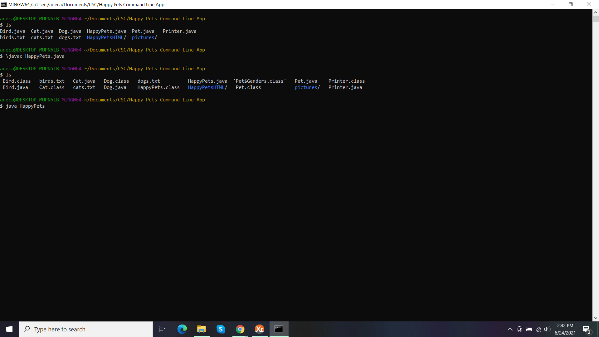
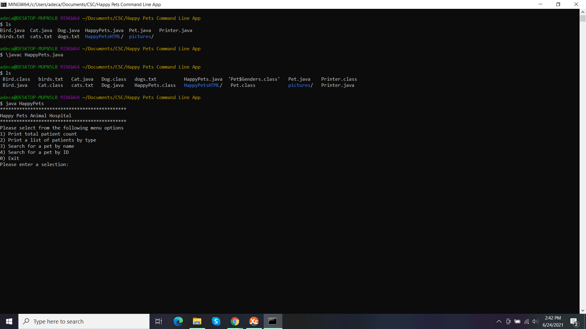

# Happy-Pets-Terminal-App

This application holds records for different pets and displays that data on the command line.

## Installation

1. Download the application.
2. Open your terminal or command line program of choice.
3. Using your terminal or command line program, navigate to the application folder.
4. Type `javac HappyPets.java` and press enter to compile the program.

## Usage

In your terminal or command line program, type `java HappyPets` and press enter.

Follow the prompts displayed in the terminal to interact with the application.

## Screenshots

